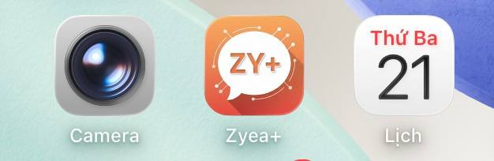

# 🎉 Zyea Chat App

<div align="center">



**Ứng dụng Chat & Mạng Xã Hội Hoàn Chỉnh**

[](https://reactjs.org/)
[](https://capacitorjs.com/)
[](https://nodejs.org/)
[](https://www.apple.com/ios/)
[](LICENSE)

[🚀 Build IPA Guide](BUILD-IPA-GUIDE.md) | [📱 Demo](#) | [🐛 Report Bug](https://github.com/Nidios1/zyea-chat-app/issues)

</div>

---

## 📱 Giới thiệu

Zyea Chat App là một ứng dụng mạng xã hội và nhắn tin hoàn chỉnh, kết hợp:

### ✨ Tính năng chính
- 💬 **Nhắn tin Real-time**: Chat với Socket.IO, typing indicators
- 📞 **Video Call**: Gọi video 1-1 và nhóm
- 📰 **NewsFeed**: Bảng tin giống Facebook với posts, reactions, comments
- 👥 **Quản lý bạn bè**: Thêm bạn, gợi ý kết bạn
- 🔔 **Push Notifications**: Thông báo tin nhắn và hoạt động
- 📸 **Chia sẻ Media**: Gửi ảnh, video, emoji
- 🎨 **UI/UX đẹp**: Responsive design cho iOS và Android
- 🌐 **PWA Support**: Cài đặt như app native

## ✅ Tính năng nổi bật

- ✅ **Cross-platform**: iOS Native, Android, và PWA
- ✅ **Real-time Chat**: Socket.IO cho messaging tức thì
- ✅ **Video Call**: WebRTC integration
- ✅ **Badge Notifications**: Hiển thị số tin nhắn chưa đọc
- ✅ **Mobile Responsive**: Tối ưu cho iOS và Android
- ✅ **Offline Support**: Service Worker caching
- ✅ **CI/CD Ready**: Codemagic & GitHub Actions workflows

## 🏗️ Kiến trúc

```
┌─────────────────────────────────────────┐
│         Zyea+ NewsFeed App              │
│         (com.zyea.app)                  │
│  ┌────────────────────────────────────┐ │
│  │ 📰 NewsFeed                        │ │
│  │ 📸 Stories                         │ │
│  │ 💬 Messages Badge [3] ──────────┐ │ │
│  └────────────────────────────────────┘ │
└─────────────────────────────────────────┘
                  │ Deep Link
                  │ zyeamessenger://open
                  ↓
┌─────────────────────────────────────────┐
│         Zyea+ Messenger App             │
│         (com.zyea.hieudev)              │
│  ┌────────────────────────────────────┐ │
│  │ 💬 Chat conversations              │ │
│  │ 📞 Video calls                     │ │
│  │ 👥 Contacts                        │ │
│  └────────────────────────────────────┘ │
└─────────────────────────────────────────┘
```

## 🚀 Quick Start

### 1. Clone Repository

```bash
git clone https://github.com/YOUR_USERNAME/zyea-plus-social-network.git
cd zyea-plus-social-network
```

### 2. Setup Server

```bash
cd server
npm install
cp config.env.example config.env
# Edit config.env with your database credentials
node setup_database.js
npm start
```

### 3. Build Messenger App

```bash
cd client
npm install
npm run build:win
npx cap sync android
npx cap open android
```

### 4. Build NewsFeed App

```bash
cd zyea-plus-app
npm install
npm run build:win
npx cap sync android
npx cap open android
```

**Hoặc dùng scripts:**
- `BUILD-TEST-MOBILE.bat` - Build Messenger app
- `BUILD-ZYEA-PLUS-APP.bat` - Build NewsFeed app

## 📚 Documentation

- 📘 [QUICK-START-2-APPS.md](QUICK-START-2-APPS.md) - Hướng dẫn nhanh
- 📗 [ZYEA-PLUS-APP-README.md](ZYEA-PLUS-APP-README.md) - Chi tiết đầy đủ
- 📕 [GITHUB-UPLOAD-GUIDE.md](GITHUB-UPLOAD-GUIDE.md) - Upload & build IPA
- 📊 [SUMMARY-2-APPS.md](SUMMARY-2-APPS.md) - Tóm tắt project

## 🛠️ Tech Stack

### Frontend
- **React** 18.2.0
- **Capacitor** 5.5.1 (iOS/Android native)
- **Socket.IO Client** 4.7.2
- **React Router** 6.15.0
- **Styled Components** 6.0.7
- **Material-UI** 5.14.16

### Backend
- **Node.js** 18+
- **Express** 4.18+
- **MySQL** 8.0+
- **Socket.IO** 4.7.2
- **JWT** Authentication

### DevOps
- **GitHub Actions** - CI/CD
- **Codemagic** - iOS/Android builds
- **Docker** (optional)

## 📱 Screenshots

### Zyea+ NewsFeed App
- TopBar với nút tin nhắn có badge
- NewsFeed với posts
- Khoảnh khắc (Stories)

### Zyea+ Messenger App
- Chat conversations
- Message UI
- Video call interface

## 🔐 Security

- ✅ JWT Authentication
- ✅ Password hashing với bcrypt
- ✅ SQL injection protection
- ✅ XSS protection
- ✅ CORS configuration

## 📦 Build & Deploy

### Build Android APK

```bash
# Messenger
cd client
npm run android

# NewsFeed
cd zyea-plus-app
npm run android
```

### Build iOS IPA

**Option 1: Local (Requires Mac + Xcode)**
```bash
cd client
npm run ios
```

**Option 2: Codemagic (Recommended)**
1. Push code to GitHub
2. Go to https://codemagic.io
3. Connect repository
4. Start build
5. Download IPA

See [GITHUB-UPLOAD-GUIDE.md](GITHUB-UPLOAD-GUIDE.md) for details.

## 🌐 API Endpoints

### Authentication
- `POST /auth/register` - Register new user
- `POST /auth/login` - Login user
- `GET /users/profile` - Get user profile

### Chat
- `GET /chat/conversations` - Get conversations
- `POST /chat/send` - Send message
- `DELETE /chat/message/:id` - Delete message

### NewsFeed
- `GET /newsfeed/posts` - Get posts
- `POST /newsfeed/create` - Create post
- `POST /newsfeed/like/:id` - Like post
- `POST /newsfeed/comment/:id` - Comment on post

## 🤝 Contributing

Contributions are welcome! Please follow these steps:

1. Fork the repository
2. Create a feature branch (`git checkout -b feature/AmazingFeature`)
3. Commit your changes (`git commit -m 'Add some AmazingFeature'`)
4. Push to the branch (`git push origin feature/AmazingFeature`)
5. Open a Pull Request

## 📄 License

This project is licensed under the MIT License - see the [LICENSE](LICENSE) file for details.

## 👨‍💻 Author

**HieuDev**
- GitHub: [@hieudev](https://github.com/hieudev)
- Email: hieudev@example.com

## 🙏 Acknowledgments

- [React](https://reactjs.org/)
- [Capacitor](https://capacitorjs.com/)
- [Socket.IO](https://socket.io/)
- [Material-UI](https://mui.com/)
- [Codemagic](https://codemagic.io/)

## 📞 Support

If you have any questions or issues:
1. Check the [Documentation](QUICK-START-2-APPS.md)
2. Open an [Issue](https://github.com/YOUR_USERNAME/zyea-plus-social-network/issues)
3. Contact: hieudev@example.com

---

<div align="center">

Made with ❤️ by HieuDev

⭐ Star this repo if you like it!

</div>
